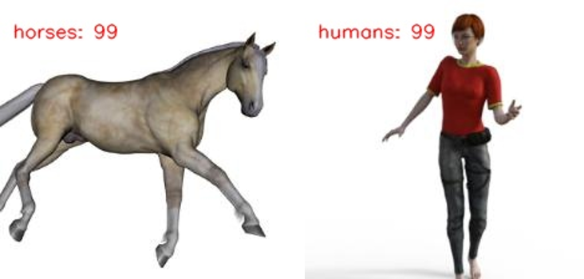

# Horses_or_Humans_Classification-MobileNet_224

**Version:** 1.001.001

**Category:** Classification

**TrainingProgram:** [MobileNetV2]() 

**Algorithm:** [MobileNetV2](./opt.yaml)

**Dataset:** [horses_or_humans](https://www.tensorflow.org/datasets/catalog/horses_or_humans)

**Class:** `Horses`, `Humans`

The model is a MobileNetV2 model trained on the Opensource Horses or Humans Classification dataset.

### Supported VA8801 Version

| Format | VA8801 Shuttle  |
| --- | --- |
| TFLite - INT8 | ✅ |

### Network

|  | Type | Batch | Shape | Remark |
| --- | --- | --- | --- | --- |
| Input | image | 1 | [224, 224, 3] | The input image should be resized to 224x224x3 pixels. |
| Output | classification | 1 | [1, 2] | The output is a 2-dimension tensor, each of which represents the probability of the corresponding class. |

### Benchmark

| Backend | Top-1(%) | Flops(M) | Params(M) | Inference(ms) | Download | Author |
| --- | --- | --- | --- | --- | --- | --- |
| TFLite - INT8 | 91.02 | - | 5.99 | - | [link](./VA8801_MobileNetV2_1.001.001-int8.tflite) | Fitipower |

***Table Notes:***

- ***Backend:** The deep learning framework used to infer the model.*
- ***Top-1:** The top-1 number indicates how many times the network has predicted the correct label with the highest probability.*
- ***Inference(ms):** The inference time of the model in milliseconds.*
- ***Link:** The link to the model.*
- ***Author:** the author of the model.*
