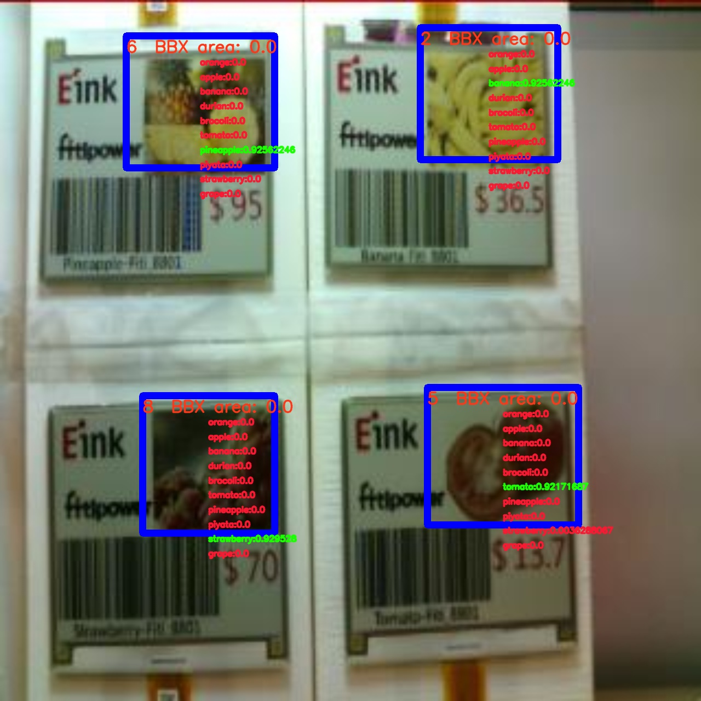

# Fruit ESL - ResNet

**Version:** 2.001.001

**Category:** Object Detection

**Algorithm:** [ResNet](https://fp-gitlab/hcita/tinyml/yolov5/-/blob/hcita/ResNet/models/resnet50.yaml)

**Dataset:** ESL

**Class:** Orange, Apple, Banana, Durian, Broccoli, Tomato, Pineapple, Pitaya, Strawberry, Grape

    

### Supported VA8801 Version

| Format | VA8801 Shuttle  |
| --- | --- |
| TFLite - INT8 | ✅ |

### Network

|	    |  Type	| Batch	| Shape        | Remark                                                           |
|:------|:------|:------|:-----------  |:-----------------------------------------------------------------|
| Input | image |   1   | [320,320,3]  | The input image should be resized to 96x96x1                     |
| Output| bbox  |   1   | [1500,15]    | The output is a 1500x15 tensor, 1500 is the number of candidates |

### Benchmark

| Backend      | Precision(%) | Recall(%) | GFlops   | Params(K) | Inference(ms) |   Download                                                                                                                                     | Author   |
|:------------:|:-------------|:----------|:---------|:----------|:-------------:|:-----------------------------------------------------------------------------------------------------------------------------------------------|:---------|
|  TFLite-int8 |    96.30     |    91.50  |    ---   |    769    |       -       | [link](https://fp-gitlab/hcita/tinyml/va8801_model_zoo/-/blob/develop/ClassicalModels(CM)/resnet/ObjectDetection/ResNet_2.001.001.tflite)      | Fitipower|

***Table Notes:***

- ***Evaluation Parameters:** Confidence Threshold: 0.5, IoU Threshold: 0.45
- ***Backend:** The deep learning framework used to infer model.*
- ***Inference(ms):** The inference time of the model in milliseconds.*
- ***Author:** The author of the model.*
