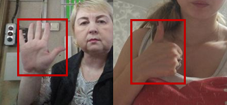

# Hand Gestures Detection - Yolo

**Version:** 3.001.001

**Category:** Object Detection

**Algorithm:** [Yolov5](https://fp-gitlab/hcita/tinyml/va8801_model_zoo/-/blob/develop/ObjectDetection(OD)/Hand_Gestures/opt.yaml)

**Dataset:** 

**Class:** 'palm','fist'

    

### Network
|      | Type  | Batch   | Shape      | Remark                                               |
|:---- |:------|:-------:|:-----------|:-----------------------------------------------------|
|Input | image |   1     | [320,320,3]| The input image should be resized to 320x320 pixels. |
|Output| bbox  |   1     | [1500,7]   | The output is a 1500x7 tensor.                       |

### Benchmark

| Backend      | Precision(%) | Recall(%) | GFlops   | Params(M) | Inference(ms) |       Download                                                                                                                                | Author   |
|:------------:|:-------------|:----------|:---------|:----------|:-------------:|:----------------------------------------------------------------------------------------------------------------------------------------------|:---------|
|  TFLite-int8 |    97.60     |    95.80  |    4.0   |    1.8    |       160       |      [link](https://fp-gitlab/hcita/tinyml/va8801_model_zoo/-/blob/develop/ObjectDetection(OD)/Hand_Gestures/Hand_Gestures_3_001_001.tflite)     | Fitipower|
