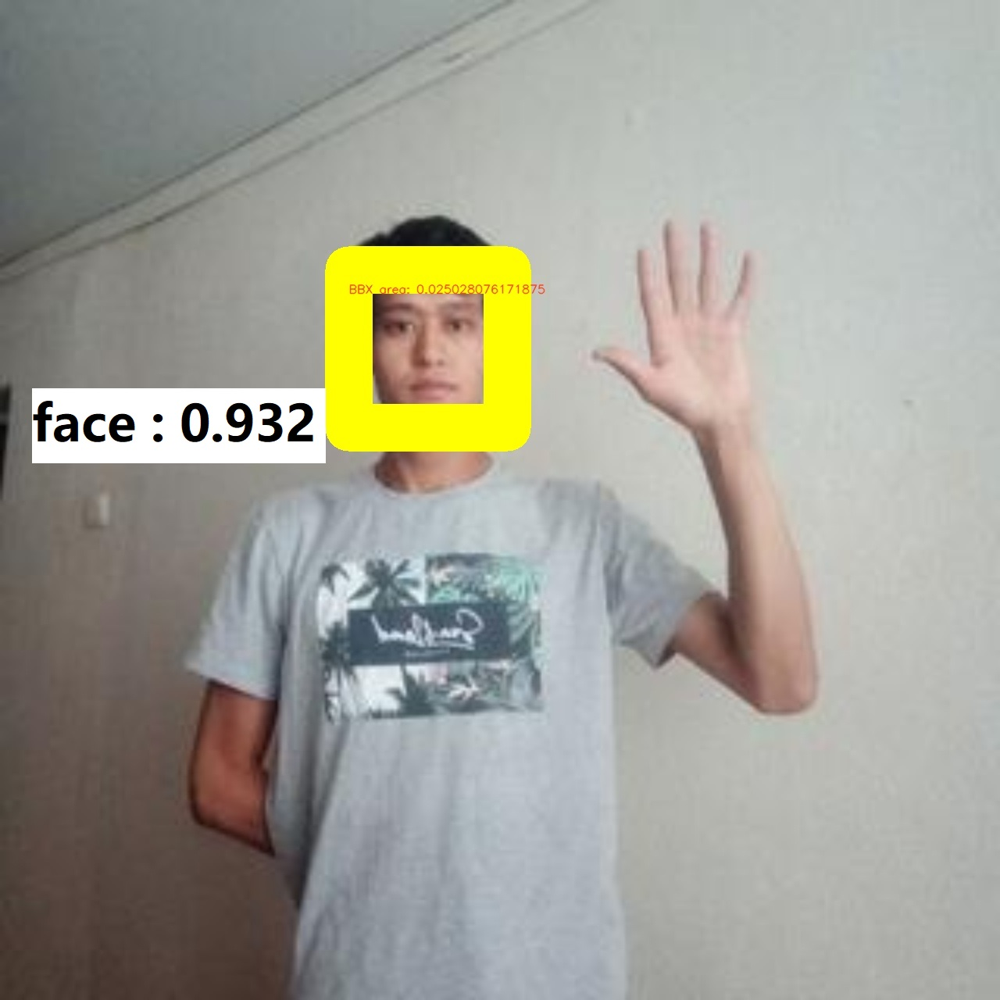

# Face Detection - Yolo

**Version:** 3.001.001

**Category:** Object Detection

**TrainingProgram:** [Yolov5](https://github.com/FITI-HCITA/yolov5)

**Algorithm:** [Yolov5](https://github.com/FITI-HCITA/VA8801_Model_Zoo/blob/main/ObjectDetection/Face_Detection/Yolo/opt.yaml)

**Dataset:** COCO-human

**Class:** Face

    

### Supported VA8801 Version

| Format | VA8801 Shuttle  |
| --- | --- |
| TFLite - INT8 | ✅ |

### Network

|	    |  Type	| Batch	| Shape        | Remark                                                           |
|:------|:------|:------|:-------------|:-----------------------------------------------------------------|
| Input | image |   1   | [320,320,3]  | The input image should be resized to 320x320x3                   |
| Output| bbox  |   1   | [1500,6]     | The output is a 1500x6 tensor, 1500 is the number of candidates  |

### Benchmark

| Backend      | Precision(%) | Recall(%) | GFlops   | Params(M) | Inference(ms) | Used Ram(MB) |      Download                                                                                                                                | Author   |
|:------------:|:-------------|:----------|:--------:|:---------:|:-------------:|:------------:|:----------------------------------------------------------------------------------------------------------------------------------------------|:---------|
|  TFLite-int8 |    94.50     |    96.60  |    4.0   |    1.8    |       48        | 2.89 |      [link](https://github.com/FITI-HCITA/VA8801_Model_Zoo/blob/main/ObjectDetection/Face_Detection/Yolo/Face_Det_3_001_001.tflite)  | Fitipower|

***Table Notes:***

- ***Evaluation Parameters:** Confidence Threshold: 0.6, IoU Threshold: 0.45*
- ***Backend:** The deep learning framework used to infer model.*
- ***Inference(ms):** The inference time of the model in milliseconds.*
- ***Author:** The author of the model.*
