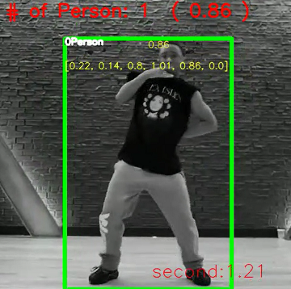
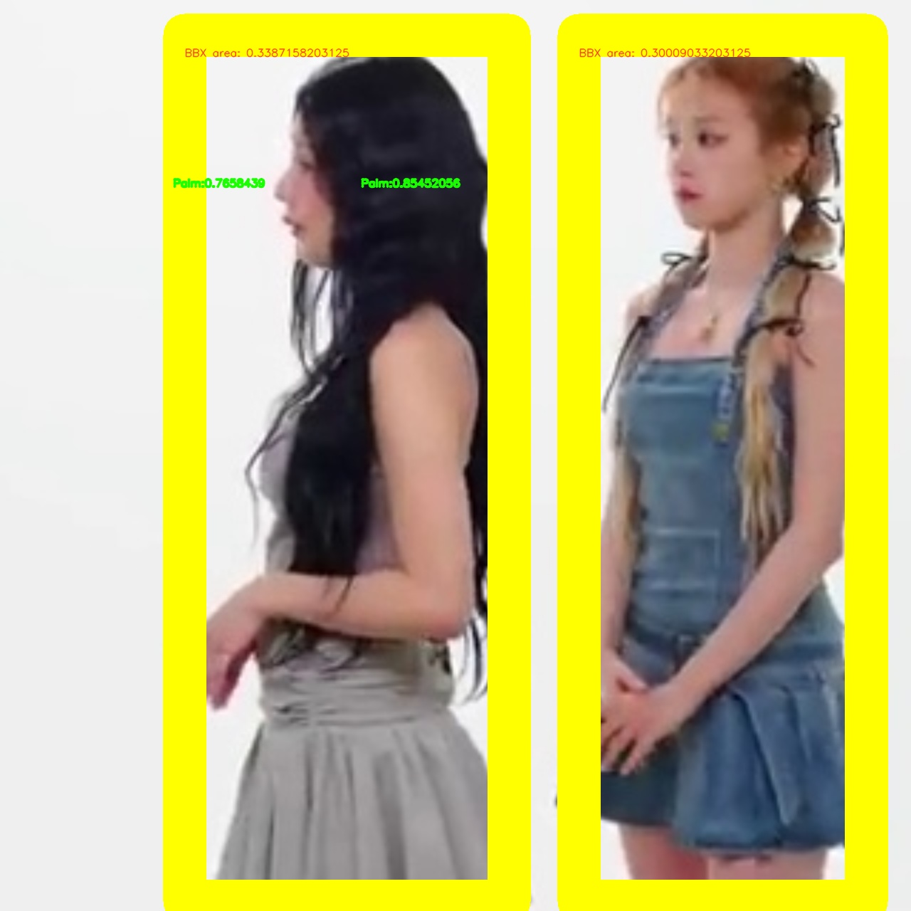

# Human Detection - Yolo

**Version:** 6.001.001 / 7.002.002 / 8.001.001

**Category:** Object Detection

**TrainingProgram:** [Yolov5](https://github.com/FITI-HCITA/yolov5/tree/human_detect_VA8801)

**Algorithm:** [Yolov5](https://github.com/FITI-HCITA/VA8801_Model_Zoo/blob/main/ObjectDetection/Human_Detection/Yolo/opt.yaml)

**Dataset:** COCO-human,surveillance,cctv-fitipower

**Class:** Human

    

    

### Supported VA8801 Version

| Format | VA8801 Shuttle  |
| --- | --- |
| TFLite - INT8 | ✅ |

### Network

|LowPower|  Type	| Batch	| Shape      | Remark                                                         |
|:------ |:------|:------|:-----------|:---------------------------------------------------------------|
| Input  | image |   1   | [96,96,1]  | The input image should be resized to 96x96x1                   |
| Output | bbox  |   1   | [567,6]    | The output is a 576x6 tensor, 576 is the number of candidates  |

|Standard|  Type	| Batch	| Shape      | Remark                                                         |
|:------ |:------|:------|:-----------|:---------------------------------------------------------------|
| Input  | image |   1   | [224,224,1]  | The input image should be resized to 224x224x1                   |
| Output | bbox  |   1   | [3087,6]    | The output is a 3087x6 tensor, 3087 is the number of candidates  |

|Normal  |  Type	| Batch	| Shape      | Remark                                                         |
|:------ |:------|:------|:-----------|:---------------------------------------------------------------|
| Input  | image |   1   | [320,320,3]  | The input image should be resized to 320x320x3                   |
| Output | bbox  |   1   | [1500,6]    | The output is a 1500x6 tensor, 1500 is the number of candidates  |

### Benchmark

|Application| Backend      | Precision(%) | Recall(%) | GFlops   | Params(K) | Inference(ms) | Used Ram(KB) |     Download                                                                                                                                | Author   |
|:---------:|:------------:|:-------------|:----------|:---------|:----------|:-------------:|:------------:|:----------------------------------------------------------------------------------------------------------------------------------------------|:---------|
|LowPower   |  TFLite-int8 |    95.30     |    90.20  |    0.5   |    120    |       34       | 176.74 |      [link](https://github.com/FITI-HCITA/VA8801_Model_Zoo/blob/main/ObjectDetection/Human_Detection/Yolo/HUMAN_DET_6_001_001.tflite)  | Fitipower|
|Standard   |  TFLite-int8 |    95.00     |    96.70  |    0.5   |    260    |       34       | 176.74 |      [link](https://github.com/FITI-HCITA/VA8801_Model_Zoo/blob/main/ObjectDetection/Human_Detection/Yolo/HUMAN_DET_8_001_001.tflite)  | Fitipower|
|Normal     |  TFLite-int8 |    97.50     |    99.10  |    4.0   |    1.8    |       48        | 2.89 |      [link](https://github.com/FITI-HCITA/VA8801_Model_Zoo/blob/main/ObjectDetection/Human_Detection/Yolo/HUMAN_DET_7_002_002.tflite)  | Fitipower|

***Table Notes:***

- ***Evaluation Parameters:** Confidence Threshold: 0.6, IoU Threshold: 0.45*
- ***Backend:** The deep learning framework used to infer model.*
- ***Inference(ms):** The inference time of the model in milliseconds.*
- ***Author:** The author of the model.*
