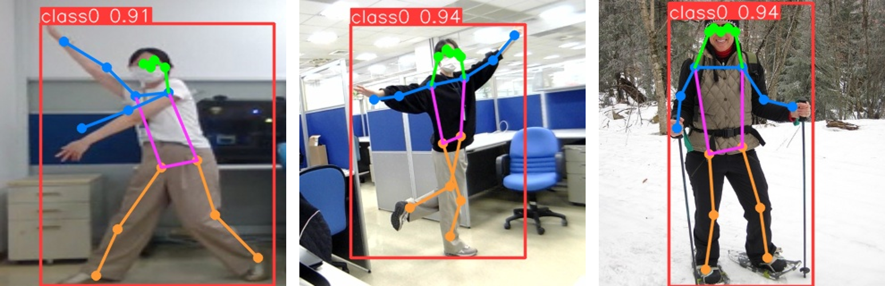

# Pose_Estimation_Yolo_320

**Version:** 1.001.001

**Category:** Pose Estimation

**TrainingProgram:** [Yolov8-pose v8.1.0](https://github.com/ultralytics/ultralytics/releases/tag/v8.1.0) 

**Algorithm:** [Yolov8-pose v8.1.0](https://github.com/ultralytics/ultralytics/releases/tag/v8.1.0)

**Dataset:** COCO128-pose dataset

**Class:** `person`

The model is a YOLOv8 v8.1.0 pose model trained on the Opensource COCO128-pose dataset.

### Supported VA8801 Version

| Format | VA8801 Shuttle  |
| --- | --- |
| TFLite - INT8 | ✅ |

### Network

|  | Type | Batch | Shape | Remark |
| --- | --- | --- | --- | --- |
| Input | image | 1 | [320, 320, 3] | The input image should be resized to 320x320x3 pixels. |
| Output | pose estimation | 1 | [1, 56, 2100] | The output is a 56x2100 tensor, where 2100 is the number of candidate boxes and keypoints. 56 is [x1, y1, x2, y2, score, [class], px0, py0, p0-visibility, …, px16, py16, p16-visibility] |

### Benchmark

| Backend | mAP50-pose | Flops(B) | Params(M) | Inference(ms) | Download | Author |
| --- | --- | --- | --- | --- | --- | --- |
| pytorch | 80.1 | 9.2 | 3.3 | - | [link](https://github.com/ultralytics/assets/releases/download/v0.0.0/yolov8n-pose.pt) | ultralytics |
| TFLite - INT8 | - | - | 3.3 | - | [link](./yolov8n-pose_full_integer_quant_320.tflite) | ultralytics |

***Table Notes:***

- ***Backend:** The deep learning framework used to infer the model.*
- ***mAP50-pose:** The mean Average Precision at a 50% Intersection Over Union (IoU) threshold for pose estimation.*
- ***Inference(ms):** The inference time of the model in milliseconds.*
- ***Link:** The link to the model.*
- ***Author:** the author of the model.*

---

### How to Generate Yolov8 pose model for VA8801?
Based on [Yolov8 revised by DeGirum](https://github.com/DeGirum/ultralytics_degirum) release the method for exporting a YOLO model with 6 separate outputs, for improved performance in quantized models. 

