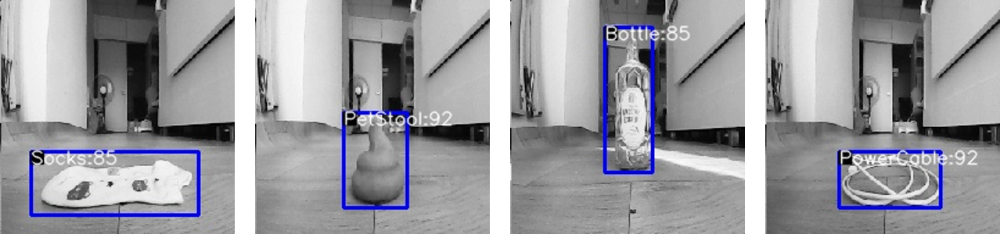

# Sweeping_Robot_Detection-YOLO_320

**Version:** 1.002.002

**Category:** Object Detection

**TrainingProgram:** [Yolov5](https://github.com/FITI-HCITA/yolov5/tree/ROT_IRAI_VA8801)

**Algorithm:** [Yolov5](./opt.yaml)

**Dataset:** Fitipower IR Cam Sweeping Robot Dataset 

**Class:** `Socks`, `PetStool`, `Bottle`, `PowerCable`

The model is a YOLOv5 model trained on the GC0308 IR CAM Sweeping Robot Object Detection dataset.

### Network

|  | Type | Batch | Shape | Remark |
| --- | --- | --- | --- | --- |
| Input | image | 1 | [320, 320, 1] | The input image should be taken by GC0308 IR cam  resized to 192x192 pixels. |
| Output | bbox | 1 | [1, 1500, 9] | The output is a 1500x9 tensor, where 1500 is the number of candidate boxes and 9 is [x, y, w, h, score, [class]] |

### Benchmark

| Backend | Precision(%) | Recall(%) | Flops(M) | Params(M) | Inference(ms) | Used Ram(MB) | Download | Author |
| --- | --- | --- | --- | --- | --- | --- | --- | --- |
| TFLite - INT8 | 98 | 94 | - | 2,234,398 | 78 | 3.12 | [link](./VA8801_ROTBOT_1.002.002-int8.tflite) | Fitipower |

***Table Notes:***

- ***Evaluation Parameters:** Confidence Threshold: 0.4, IoU Threshold: 0.55.*
- ***Backend:** The deep learning framework used to infer the model.*
- ***Metrics:** The metrics used to evaluate the model.*
- ***Inference(ms):** The inference time of the model in milliseconds.*
- ***Link:** The link to the model.*
- ***Author:** the author of the model.*
