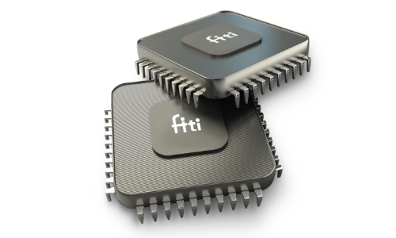

# VA8801 Model Zoo

  

[English](README.md) | 繁體中文 | [简体中文](README_zh_CN.md)

## 介紹

歡迎來到 Fitipower VA8801 Model Zoo。
VA8801是俱備高運算力且極低功耗的自主開發的邊緣運算神經網路晶片,擅長處理語音/影像及各種感測器資料(Sensor Fusion). 在主AP還未喚醒前以Sensor Hub的角色在極低功耗實時(always-on)感測及預處理環境訊息.必要時才將AP喚醒以降低系統功耗。

VA8801除內建硬體化各種訊號處理運算處理(ISP/DSP) 並配置先進人工智慧神經網路加速器執行各式AI模型(人臉偵測/物件偵測/語音偵測)並應用於各類終端產品並使其智慧化.特別是電池供電類產品(Doorbell/IPcam..)。 

我們針對不同的應用場景，提供了一系列預先訓練的模型供您使用，配合Fitipower VA8801 SDK開發環境，您可以對這些模型進行測試和推理，並輕鬆地部署到VA8801上。[聯繫我們](mailto:support.ai@fitipower.com?subject=SDK)。

VA8801 Model Zoo 專注於提供在 VA8801 優化的神經網路上訓練所得的模型，這些模型針對現實應用場景，能夠在VA8801上實現更快和更準確的推理。我們會陸續推出更多優化兼容模型。

 標準模型格式tflite INT8量化檔。
 使用Fitipower VA8801 AI compiler(Tengen)編譯模型轉換成C code代碼。

## 應用場景
目前，VA8801 Model Zoo 提供以下應用場景的預訓練模型:
 AudioSoundEvents - 異常聲音檢測
 ClassicalModels - 經典模型
 KeyWordSpotting - 關鍵詞
 ObjectDetection - 物件偵測                                                    

如果您需要特定場景下特定資料集的預訓練模型，歡迎向我們[提交 Issues]。

## 快速上手

如果您希望使用 VA8801 Model Zoo 提供的模型，我們建議您遵循以下步驟:

1. 根據實際需求，選擇相應的應用場景並挑選合適的神經網路。 您可以瀏覽我們給出的測試數據進行選擇。
2. 下載選擇好的模型。 對於公開的預訓練模型，您可以透過測試資料表中的模型連結直接下載。
3. 參考 VA8001 SDK 文件 - 部署範例在VA8801進行部署。 您也可以使用 VA8801上運行我們的模型，對我們的測試結果進行複現或推理測試。[聯繫我們](mailto:support.ai@fitipower.com?subject=SDKDEV&body=Please%20share%20SDK%20to%20us.)。

## 故障排除

如果您在使用 VA8801 Model Zoo 中預訓練模型時遇到任何問題，請向我們[提交 Issues](mailto:support.ai@fitipower.com?subject=ISSUE)。

## 開源許可證

不同的神經網路、資料集和模型受不同的開源許可證保護，具體請參考 [LICENSES](LICENSES)。